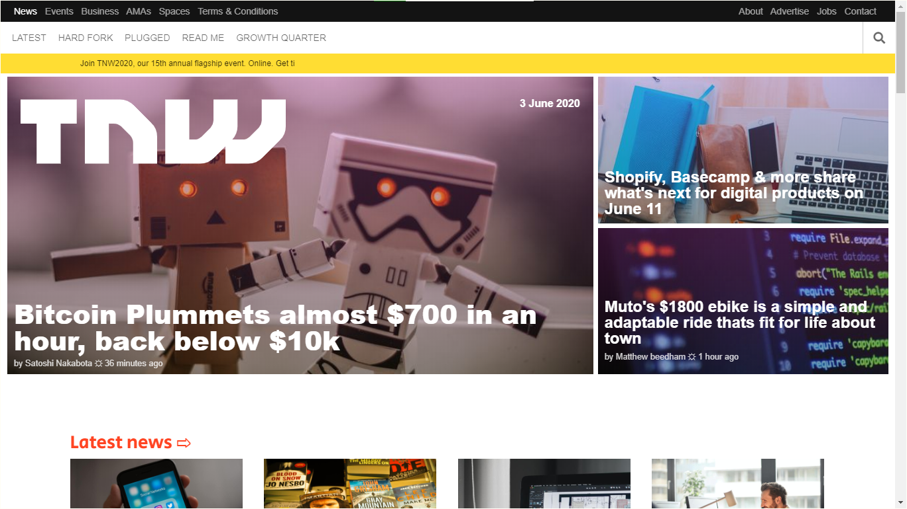

# RESPONSIVE DESIGN TNW CLONE
This is part of a series of projects to be completed by [Microverse](microverse.org) developer's program.

# Screenshoot of the page

# Source Page:
This assignment consists of making [this](https://thenextweb.com/) Clone page of Teardown Designe.

# Live Version:
The demo page can be found [here](https://raw.githack.com/dasileker/responsive-page/page/index.html)

# Built With
- HTML 
- IMAGES 
- CSS  

# GitHub
@dasileker

@TSHEPO-CLOUD

# Facebook
@Tshepomolefe

@dasileker

